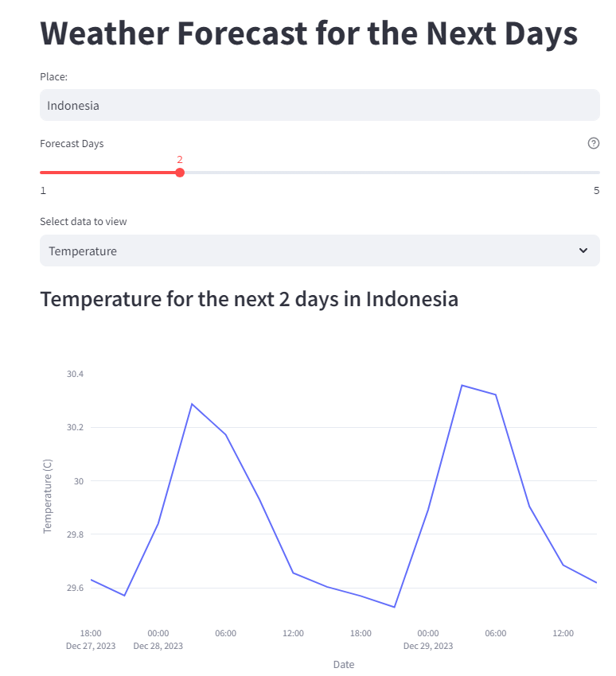
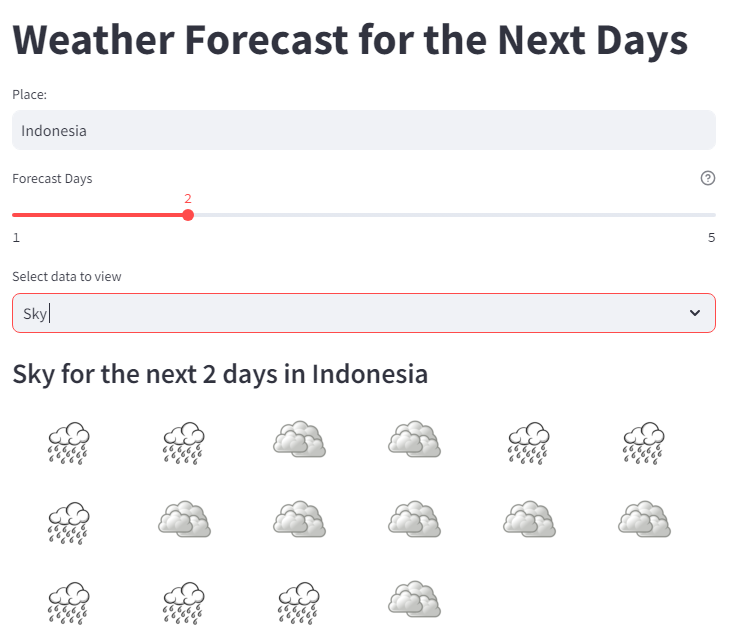

# Build a Historical Weather Data API Using Python

## Project Description

**Overview :**  
This project aims to create a Historical Weather Data API using Python where the API will provide temperature data over time and detailed weather conditions for each forecast day, along with the capability to generate a graphical representation of temperature trends.

**Challenges :**  
Build The Historical Weather Data API Using Python.

## Project Goal

The project aims to allowing users to retrieve and visualize historical weather information for a specified country and forecast duration.

## Tools & Library Used

 &nbsp;

## Project Result

[Click here to get full code](https://github.com/nickenshidqia/Build_a_Historical_Weather_Data_API_Using_Python/blob/cee616e1e693dd5647255510bec58decaf7fa9f7/main.py)

### Temperature Forecasting:

Integrate with a reliable weather data API source to fetch temperature data based on the specified country and forecast duration.  

### Weather Conditions Forecasting:

Integrate with a reliable weather data API source to fetch Weather Conditions data based on the specified country and forecast duration.  

